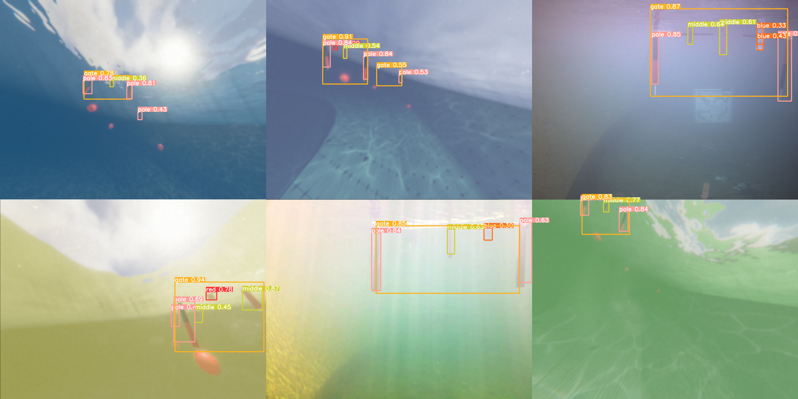

# RoboSubSim
This is a project aimed at simulating underwater environments for autonomous underwater vehicles (particularly Seawolf 8) targeted at the RoboSub Competitions.

Here is the paper (for a course project) for various features and architecture in the simulator: [https://drive.google.com/file/d/1eip_NG7Cf2Fsl2w5lEbMnAuSLVgT55id/view?usp=sharing](https://drive.google.com/file/d/1eip_NG7Cf2Fsl2w5lEbMnAuSLVgT55id/view?usp=sharing)

### Completions
* SW8 Dynamics and Communications with Rust and SimCB
* Photorealistic Outdoor Pool (1 scene)
* Automatic annotations
* Domain Randomization (visuals)
* Basic Logging (robot position)

### Feature Plans
* Dynamics Domain Randomization
* Additional environments (Indoor pools)
* Additional Robot Models
* Additional Sensors (acoustics, depth images, etc)
* ROS
* ml-agents
* control with keyboard and mouse
* Logging

### Usage (Packaged Application)
* Go to Releases to install
* For use go and install SimCB here [https://github.com/MB3hel/AUVControlBoard/releases/tag/v1.1.0-beta2](https://github.com/MB3hel/AUVControlBoard/releases/tag/v1.1.0-beta2)
* Also get the Rust robot code here [https://github.com/ncsurobotics/SW8S-Rust/tree/unity_sim_tcp](https://github.com/ncsurobotics/SW8S-Rust/tree/unity_sim_tcp)
* The tests are written in `SW8S-Rust/comms/control_board/mod.rs`, and `SW8S-Rust/src/comms/control_board/mod.rs`
* Enter the IP for TCP server so that SW8S-Rust can connect to, but SimCB is expected to be on localhost
* run `cargo test unity_tcp_connect`

### Usage (With Unity Editor)
* Download Unity Hub and get a free license
* Add this project to Unity Hub
* When launching it will ask you to get editor version `2023.1.8f1`, you need to install this version (higher might work)
* The first launch will take a while, on launch go to `Assets/Scenes` and load the `StartScene` for editor mode.
* It should be good to go now. 

### Development Progress Videos (Note: 2024/04/21)
Dynamics Testing: [https://youtu.be/PzeR5JaaQD4](https://youtu.be/PzeR5JaaQD4)\
Trajectory Visualization: [https://youtu.be/6XFExcnqDvA](https://youtu.be/6XFExcnqDvA)\
Synthetic Image Generation w/ Domain Randomization: [https://youtu.be/zcOHj0vwbpA](https://youtu.be/zcOHj0vwbpA)

### Images 
#### (Top: Synthetic and Real Images, Bottom: Detection from YOLOv5n Trained on only Synthetic Images)
 

